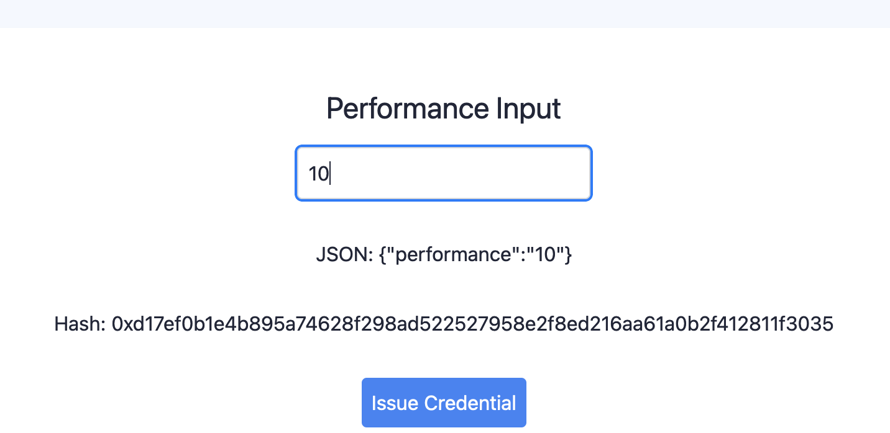

# Soulbound VC


## Description




## Quickstart

Install dependencies:

```bash
yarn install
```

Start the local blockchain:

```bash
yarn chain
```

Deploy contracts:

```bash
yarn deploy
```

Start the frontend:

```bash
yarn start
```
